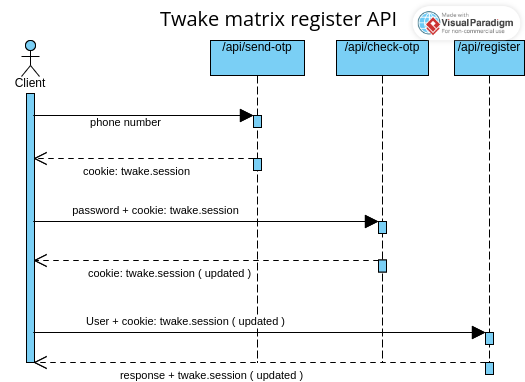

# API Documentation:

- [Send OTP](#send-otp-endpoint)
- [Check OTP](#check-otp-endpoint)
- [Create user](#create-user-endpoint)
- [Validate nickname](#validate-nickname)
- [Suggest nicknames](#suggest-nicknames)

the endpoints uses encrypted session cookies `twake.session` that is essential to the validation and the whole process of the registration.

## How it works



## Send OTP endpoint

### Description

This API endpoint allows users to send a one-time password (OTP) to the provided phone number for verification purposes. The OTP will be generated, and the result of the operation will be returned in the response along with a session cookie (`twake.session`). The `twake.session` cookie will be used by other endpoints, such as `/api/check-otp`, where the user will send the OTP alongside this cookie for verification.

### Endpoint URL

```
/api/send-otp
```

### HTTP Method

```
POST
```

### Request Parameters

#### Request Body

The request body should be in JSON format and include the following property:

| Parameter | Type   | Description                          |
| --------- | ------ | ------------------------------------ |
| phone     | string | The phone number to send the OTP to. |

Example:

```json
{
	"phone": "+1234567890"
}
```

### Response

The API endpoint returns the following response:

| Status Code | Description                                                        |
| ----------- | ------------------------------------------------------------------ |
| 200         | OK - The OTP has been sent.                                        |
| 400         | Bad Request - Invalid phone number or phone number already in use. |
| 500         | Internal error. something unexpected occured                       |

Example Response (Status Code: 200 - OK):

```
Status: 200 OK
Body: ok
```

### Error Handling

- Status Code 400: The endpoint will return a `400 Bad Request` status code in the following cases:
  - If the provided phone number is invalid (e.g., not in a valid format).
  - If the provided phone number is already in use by another user.
- Status code 500: Internal error

### Cookies

#### Twake Session Cookie

The endpoint returns a session cookie named `twake.session` in the response. This cookie is encrypted and is necessary to maintain the user's session for the next operations.

### OTP Verification in Other Endpoints

The `twake.session` cookie received from this endpoint (`/api/send-otp`) should be included in subsequent requests, such as `/api/check-otp`, alongside the OTP for verification.

---

## Check OTP endpoint: `/api/check-otp`

### Description

This API endpoint allows users to check if the provided OTP (One-Time Password) is valid. It requires the user's password in the request body and a valid session cookie for authentication.

### Endpoint URL

```
/api/check-otp
```

### HTTP Method

POST

### Request Parameters

#### Request Body

The request body should be in JSON format and include the following property:

| Parameter | Type   | Description                           |
| --------- | ------ | ------------------------------------- |
| password  | string | The user's password for verification. |

Example:

```json
{
	"password": "1234"
}
```

### Cookies

#### Session Cookie

The endpoint requires a valid session cookie for user authentication that is obtained from the `/api/send-otp`. The session cookie should be sent along with the request headers.

Example:

```
Cookie: twake.session=your_session_cookie_value
```

### Response

The API endpoint returns the following response:

| Status Code | Description                                   |
| ----------- | --------------------------------------------- |
| 200         | OK - The OTP is valid.                        |
| 400         | Bad Request - The request is malformed.       |
| 401         | Unauthorized - The OTP provided is incorrect. |
| 500         | Internal Server Error - An error occurred.    |

Example Response (Status Code: 200 - OK):

```
Status: 200 OK
Body: ok
```

### Error Handling

- Status Code 400: If the request is malformed, or the session cookie is not valid, the endpoint will return a `400 Bad Request` status code.
- Status Code 401: If the OTP provided does not match the code sent to the phone number, the endpoint will return a `401 Unauthorized` status code.
- Status code 500: If an internal error happens.

## Create user endpoint

### Description

This API endpoint allows users to register for the application. It requires the user's nickname, password, and optionally a recovery email and a display name for account registration. Additionally, the user's phone number must be verified through a previous process before registration. The endpoint returns a `201 Created` status code upon successful registration.

### Endpoint URL

```
/api/register
```

### HTTP Method

```
POST
```

### Request Parameters

#### Request Body

The request body should be in JSON format and include the following properties:

| Parameter      | Type   | Description                                                |
| -------------- | ------ | ---------------------------------------------------------- |
| nickname       | string | The user's nickname for registration.                      |
| firstname    | string | The user's display name.                        |
| lastname    | string | The user's display name.                        |
| phone | string | The user's phone number |
| password       | string | The user's password for account authentication.            |

Note:

- the password must be at least 8 characters long, with at least a symbol, upper and lower case letters and a number.

Example:

```json
{
  "nickname": "exampleUser123",
  "firstname":  "John",
  "lastname": "Doe",
  "password": "SecurePass123+",
  "phone":  "+21622222222",
}
```

### Cookies

#### Twake Session Cookie

The endpoint requires a valid Twake session cookie (`twake.session`) obtained from the `/api/check-otp` endpoint. The session cookie should be sent along with the request headers.

Example:

```
Cookie: twake.session=your_twake_session_cookie_value
```

### Response

The API endpoint returns the following response:

| Status Code | Description                                                      |
| ----------- | ---------------------------------------------------------------- |
| 201         | Created - The user has been registered.                          |
| 400         | Bad Request - The request is malformed or contains invalid data. |
| 401         | Unauthorized - The user's phone is not verified.                 |
| 500         | Interna error.                                                   |

Example Response (Status Code: 201 - Created):

```
Status: 201 Created
Body: ok
```

a lemondldap cookie will be set when completing the registration successfully.

### Error Handling

- Status Code 400: The endpoint will return a `400 Bad Request` status code in the following cases:
  - If the request is malformed or missing required fields (e.g., nickname, password).
  - If the provided password does not meet the password validation criteria.
  - If the provided firstname and lastname are not valid.
  - If the provided nickname is not available or invalid.
  - If the provided phone number is not available.
- Status Code 401: If the user's phone is not verified, does not match the verified phone, the endpoint will return a `401 Unauthorized` status code.
- Status code 500: If an internal error occured.

## Validate nickname

### Description

This API endpoint allows users to validate a given nickname and check if it's available.

### Endpoint URL

```
/api/check-nickname
```

### HTTP Method

```
POST
```

### Request Parameters

#### Request Body

The request body should be in JSON format and include the following property:

| Parameter | Type   | Description                          |
| --------- | ------ | ------------------------------------ |
| nickname     | string | the nickname to check. |

Example:

```json
{
	"nickname": "kferjani"
}
```

### Response

The API endpoint returns the following response:

| Status Code | Description                                                        |
| ----------- | ------------------------------------------------------------------ |
| 200         | OK - The nickname is valid and is available.                       |
| 400         | Bad Request - Invalid nickname or nickname is already in use.      |
| 500         | Internal error. something unexpected occured                       |

Example Response (Status Code: 200 - OK):

```
Status: 200 OK
Body: ok
```

### Error Handling

- Status Code 400: The endpoint will return a `400 Bad Request` status code in the following cases:
  - If the provided nickname is invalid (e.g., not in a valid format).
  - If the provided nickname is already in use by another user.
- Status code 500: Internal error


## Suggest nicknames

### Description

This API endpoint allows users get a list of suggested available nicknames using their first and last names.

### Endpoint URL

```
/api/suggest-nicknames
```

### HTTP Method

```
POST
```

### Request Parameters

#### Request Body

The request body should be in JSON format and include the following property:

| Parameter | Type   | Description                          |
| --------- | ------ | ------------------------------------ |
| firstname | string | the user firstname.                  |
| lastname  | string | the user lastname.                   |

Example:

```json
{
	"firstname": "John",
	"lastname": "Doe"
}
```

### Response

The API endpoint returns the following response:

| Status Code | Description                                                        |
| ----------- | ------------------------------------------------------------------ |
| 200         | OK - returns a list of suggested available nicknames               |
| 400         | Bad Request - missing or invalid firstname or lastname             |
| 500         | Internal error. something unexpected occured                       |

Example Response (Status Code: 200 - OK):

```json
Status: 200 OK
Body: [
    "john.doe",
    "john_doe",
    "doe.john",
    "john-doe",
    "doe"
]
```

### Error Handling

- Status Code 400: The endpoint will return a `400 Bad Request` status code in the following cases:
  - If the is not provided firstname or lastname
  - If the provided firstname or lastname is invalid.
- Status code 500: Internal error
